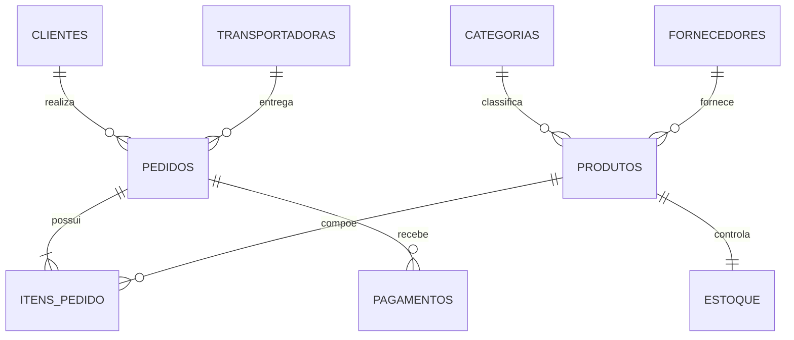

# SQL Bootcamp — Oracle

<p align="center">
  <strong>Bootcamp open source de SQL em português, direto ao ponto, orientado à prática e compatível com Oracle Live SQL.</strong>
</p>

<p align="center">
  
  
  
  
</p>

## Sobre o projeto

O **SQL Bootcamp** é um curso progressivo para quem quer aprender SQL sem uma trilha excessivamente fragmentada.

Em vez de criar um módulo para cada comando, assuntos relacionados foram reunidos em **7 módulos completos**. Cada módulo contém explicação, exemplos, boas práticas, exercícios e soluções.

O conteúdo utiliza principalmente **Oracle Database** e o banco fictício **Loja Virtual**.

## O que você aprenderá

- Fundamentos de consultas, filtros e ordenação.
- Funções de texto, números e datas.
- `CASE`, agregações, `GROUP BY` e `HAVING`.
- `INNER`, `LEFT`, `RIGHT`, `FULL` e `SELF JOIN`.
- `UNION`, `UNION ALL`, `INTERSECT` e `MINUS`.
- Subqueries, `EXISTS`, `ANY`, `ALL`, CTEs e window functions.
- `INSERT`, `UPDATE`, `DELETE` e `MERGE`.
- Criação e alteração de tabelas e constraints.
- Views, materialized views, indexes, sequences e synonyms.
- Fundamentos de PL/SQL: procedures, functions, packages e triggers.
- Projeto final utilizando o cenário de uma Loja Virtual.

### Fora do escopo

Para manter o bootcamp enxuto, não fazem parte da trilha:

- gerenciamento de transações (`COMMIT`, `ROLLBACK`, `SAVEPOINT`);
- explain plan e tuning de performance;
- locks e sessões;
- auditoria;
- administração Oracle/DBA.

## Trilha do bootcamp

| # | Módulo | Conteúdo |
|---|---|---|
| 01 | [Fundamentos de SQL](modules/01-fundamentos-sql) | SELECT, aliases, DISTINCT, WHERE, LIKE, IN, BETWEEN, NULL e ORDER BY |
| 02 | [Funções e Agregações](modules/02-funcoes-agregacoes) | Texto, números, datas, CASE, agregações, GROUP BY e HAVING |
| 03 | [Joins e Conjuntos](modules/03-joins-conjuntos) | INNER/OUTER/SELF JOIN, UNION, UNION ALL, INTERSECT e MINUS |
| 04 | [Consultas Avançadas](modules/04-consultas-avancadas) | Subqueries, EXISTS, ANY, ALL, CTE e window functions |
| 05 | [Manipulação de Dados](modules/05-manipulacao-dados) | INSERT, UPDATE, DELETE e MERGE |
| 06 | [Estrutura do Banco e PL/SQL](modules/06-estrutura-banco-plsql) | DDL, constraints, objetos Oracle, procedures, functions, packages e triggers |
| 07 | [Projeto Final](modules/07-projeto-final) | Relatórios, indicadores, SQL avançado e PL/SQL |

## Como estudar

A sequência sugerida é simples:

1. Execute [`database/setup.sql`](database/setup.sql) para preparar o ambiente.
2. Estude um módulo por vez.
3. Execute os exemplos no Oracle Live SQL.
4. Resolva os exercícios antes de abrir as soluções.
5. Finalize com o projeto da Loja Virtual.

```bash
git clone https://github.com/alehchain/sql-bootcamp.git
cd sql-bootcamp
```

## Preparação do banco de dados

O ambiente de estudo é criado por:

[`database/setup.sql`](database/setup.sql)

Os scripts da pasta [`database/`](database/) preparam as tabelas, relacionamentos e dados fictícios necessários aos exercícios.

### Oracle Live SQL

1. Acesse o Oracle Live SQL.
2. Abra uma **SQL Worksheet**.
3. Copie o conteúdo de `database/setup.sql`.
4. Execute como script.
5. Comece pelo módulo 01.

Guia complementar: [docs/oracle-live-sql.md](docs/oracle-live-sql.md).

## Modelo de dados — Loja Virtual

O bootcamp utiliza um cenário fictício de comércio eletrônico.



Diagrama detalhado: [docs/modelo-dados.md](docs/modelo-dados.md).

## Estrutura do projeto

```text
sql-bootcamp/
├── database/                    # Banco de estudo e dados fictícios
├── docs/                        # Documentação complementar
├── diagrams/                    # Diagramas
├── modules/
│   ├── 01-fundamentos-sql/
│   ├── 02-funcoes-agregacoes/
│   ├── 03-joins-conjuntos/
│   ├── 04-consultas-avancadas/
│   ├── 05-manipulacao-dados/
│   ├── 06-estrutura-banco-plsql/
│   └── 07-projeto-final/
├── scripts/
├── solutions/
├── CONTRIBUTING.md
├── LICENSE
└── README.md
```

## Progressão sugerida

**Iniciante:** módulos 01 e 02  
**Intermediário:** módulos 03, 04 e 05  
**Avançado:** módulo 06  
**Prática final:** módulo 07

A proposta não é decorar comandos, mas aprender a transformar perguntas de negócio em consultas SQL claras.

## Como contribuir

Contribuições são bem-vindas. Leia [CONTRIBUTING.md](CONTRIBUTING.md) e envie um Pull Request pequeno e objetivo.

## Licença

Distribuído sob a licença MIT. Consulte [LICENSE](LICENSE).

---

<p align="center">Desenvolvido e mantido por <a href="https://github.com/alehchain">Alexandre Chain</a>.</p>
