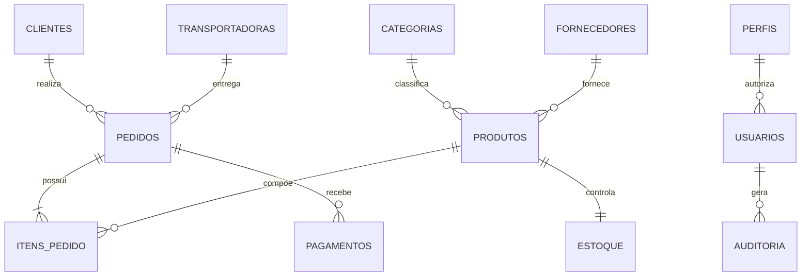

# SQL Bootcamp — Do Básico ao Avançado com Oracle

<p align="center">
  <strong>Curso open source de SQL em português, orientado à prática e compatível com Oracle Live SQL.</strong>
</p>

<p align="center">
  
  
  
  
  
</p>

## Sobre o projeto

O **SQL Bootcamp** é um curso completo e progressivo para iniciantes, estudantes, analistas, desenvolvedores e profissionais de dados que desejam aprender SQL de forma prática.

O conteúdo utiliza principalmente **Oracle Database** e foi projetado para execução no **Oracle Live SQL**. Sempre que relevante, são indicadas diferenças de sintaxe e comportamento em PostgreSQL, SQL Server e MySQL.

## O que você aprenderá

- Consultas do nível básico ao avançado.
- Modelagem e criação de estruturas relacionais.
- Funções, agrupamentos, joins, subqueries, CTEs e window functions.
- Manipulação de dados com INSERT, UPDATE, DELETE e MERGE.
- Objetos Oracle: sequences, views, materialized views, procedures, functions, packages e triggers.
- Transações, locks, sessões, auditoria e administração.
- Análise de planos de execução e otimização de consultas.
- Construção de indicadores e relatórios para uma Loja Virtual.

## Índice navegável

### Fundamentos

1. [Introdução](modules/01-introducao)
2. [SELECT](modules/02-select)
3. [WHERE](modules/03-where)
4. [ORDER BY](modules/04-order-by)
5. [DISTINCT](modules/05-distinct)
6. [LIKE](modules/06-like)
7. [IN](modules/07-in)
8. [BETWEEN](modules/08-between)
9. [IS NULL](modules/09-is-null)

### Funções, agrupamentos e joins

10. [Funções de Texto](modules/10-funcoes-texto)
11. [Funções Numéricas](modules/11-funcoes-numericas)
12. [Funções de Data](modules/12-funcoes-data)
13. [CASE](modules/13-case)
14. [GROUP BY](modules/14-group-by)
15. [HAVING](modules/15-having)
16. [INNER JOIN](modules/16-inner-join)
17. [LEFT JOIN](modules/17-left-join)
18. [RIGHT JOIN](modules/18-right-join)
19. [FULL JOIN](modules/19-full-join)
20. [SELF JOIN](modules/20-self-join)

### Operações de conjunto e consultas avançadas

21. [UNION](modules/21-union)
22. [UNION ALL](modules/22-union-all)
23. [INTERSECT](modules/23-intersect)
24. [MINUS](modules/24-minus)
25. [Subqueries](modules/25-subqueries)
26. [EXISTS](modules/26-exists)
27. [ANY](modules/27-any)
28. [ALL](modules/28-all)
29. [CTE](modules/29-cte)
30. [Window Functions](modules/30-window-functions)

### DML, DDL e objetos do banco

31. [INSERT](modules/31-insert)
32. [UPDATE](modules/32-update)
33. [DELETE](modules/33-delete)
34. [MERGE](modules/34-merge)
35. [CREATE TABLE](modules/35-create-table)
36. [ALTER TABLE](modules/36-alter-table)
37. [Constraints](modules/37-constraints)
38. [Views](modules/38-views)
39. [Materialized Views](modules/39-materialized-views)
40. [Indexes](modules/40-indexes)
41. [Sequences](modules/41-sequences)
42. [Synonyms](modules/42-synonyms)
43. [Procedures](modules/43-procedures)
44. [Functions](modules/44-functions)
45. [Packages](modules/45-packages)
46. [Triggers](modules/46-triggers)

### Transações, performance e administração

47. [Transactions](modules/47-transactions)
48. [COMMIT](modules/48-commit)
49. [ROLLBACK](modules/49-rollback)
50. [SAVEPOINT](modules/50-savepoint)
51. [Explain Plan](modules/51-explain-plan)
52. [Performance](modules/52-performance)
53. [Locks](modules/53-locks)
54. [Sessions](modules/54-sessions)
55. [Auditoria](modules/55-auditoria)
56. [Administração Oracle](modules/56-administracao-oracle)
57. [Projeto Final](modules/57-projeto-final)

## Pré-requisitos

- Navegador moderno.
- Conta gratuita da Oracle para utilizar o Oracle Live SQL.
- Conhecimentos básicos de informática.
- Nenhuma experiência prévia com banco de dados é obrigatória.

## Como utilizar

1. Prepare o banco executando [`database/setup.sql`](database/setup.sql).
2. Leia a teoria do módulo.
3. Execute os exemplos no Oracle Live SQL.
4. Resolva os exercícios sem consultar as respostas.
5. Compare sua solução com o arquivo `solucoes.sql`.
6. Registre dúvidas e aprendizados em suas próprias anotações.

```bash
# Clone o projeto
git clone https://github.com/alehchain/sql-bootcamp.git
cd sql-bootcamp
```

## Preparação do banco de dados

A forma mais rápida de preparar todo o ambiente é executar:

[`database/setup.sql`](database/setup.sql)

O arquivo cria automaticamente:

- tabelas e constraints;
- sequences;
- dados fictícios;
- views;
- índices;
- validações finais.

### Execução no Oracle Live SQL

1. Acesse o Oracle Live SQL.
2. Faça login e abra uma **SQL Worksheet**.
3. Copie todo o conteúdo de `database/setup.sql`.
4. Cole no editor.
5. Execute como script completo.
6. Confirme a mensagem: `Ambiente do SQL Bootcamp criado com sucesso!`.

Os scripts individuais continuam disponíveis na pasta [`database/`](database/) para estudo e execução separada:

1. `database/00-drop-objects.sql` — remove objetos existentes.
2. `database/01-schema.sql` — cria tabelas e constraints.
3. `database/02-sequences.sql` — cria sequences.
4. `database/03-seed-data.sql` — carrega os dados fictícios.
5. `database/04-views.sql` — cria views didáticas.
6. `database/05-indexes.sql` — cria índices adicionais.

Veja o guia completo em [docs/oracle-live-sql.md](docs/oracle-live-sql.md).

## Banco de dados Loja Virtual

O curso utiliza um domínio fictício de comércio eletrônico com clientes, produtos, categorias, pedidos, pagamentos, fornecedores, transportadoras, estoque, funcionários, usuários, perfis e auditoria.



Diagrama detalhado: [docs/modelo-dados.md](docs/modelo-dados.md).

## Estrutura do projeto

```text
sql-bootcamp/
├── .github/              # Templates e automações do GitHub
├── assets/               # Recursos de apoio
├── database/             # Estrutura e carga do banco
├── diagrams/             # Diagramas Mermaid
├── docs/                 # Documentação complementar
├── images/               # Imagens da documentação
├── modules/              # 57 módulos do curso
├── scripts/              # Scripts utilitários
├── solutions/            # Soluções consolidadas
├── CONTRIBUTING.md
├── LICENSE
├── ROADMAP.md
└── README.md
```

## Roadmap

- [x] Arquitetura inicial do repositório.
- [x] Banco fictício Loja Virtual.
- [x] Estrutura dos 57 módulos.
- [ ] Conteúdo completo dos módulos 01–10.
- [ ] Conteúdo completo dos módulos 11–20.
- [ ] Conteúdo completo dos módulos 21–30.
- [ ] Conteúdo completo dos módulos 31–40.
- [ ] Conteúdo completo dos módulos 41–50.
- [ ] Conteúdo completo dos módulos 51–57.
- [ ] Mais de 300 exercícios comentados.
- [ ] Plano de estudos de 30, 60 e 90 dias.
- [ ] Cheatsheets e simulados.

Consulte [ROADMAP.md](ROADMAP.md).

## Como contribuir

Contribuições são bem-vindas. Leia [CONTRIBUTING.md](CONTRIBUTING.md), abra uma issue descrevendo a melhoria e envie um Pull Request pequeno e objetivo.

## FAQ

Perguntas frequentes estão disponíveis em [docs/faq.md](docs/faq.md).

## Licença

Distribuído sob a licença MIT. Consulte [LICENSE](LICENSE).

---

<p align="center">Desenvolvido e mantido por <a href="https://github.com/alehchain">Alexandre Chain</a>.</p>
