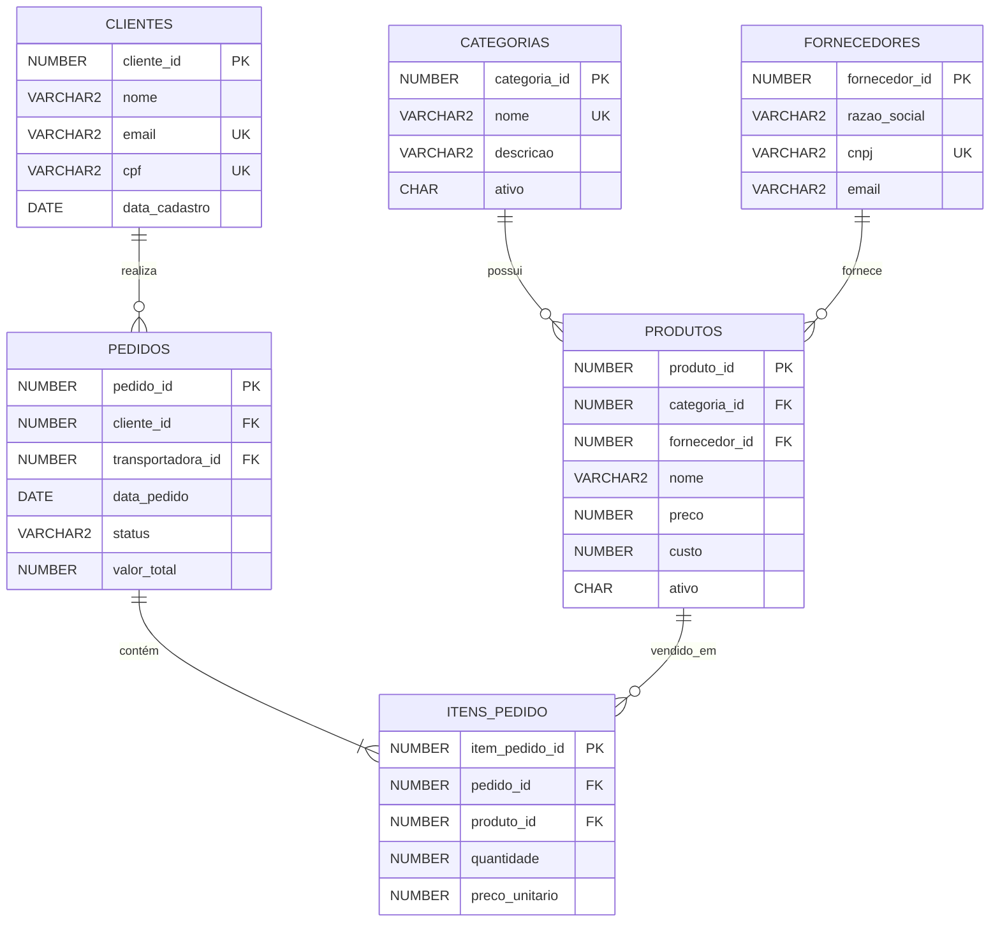

# Modelo de dados — Loja Virtual

## Visão geral

O banco foi criado para suportar exercícios de consulta, manipulação, modelagem, PL/SQL, auditoria e performance.

## Convenções

- Chaves primárias terminam com `_id`.
- Datas de criação usam `DEFAULT SYSDATE`.
- Flags utilizam `CHAR(1)` e `CHECK` com valores `S` e `N`.
- Valores monetários utilizam `NUMBER(12,2)`.
- Nomes de objetos não utilizam acentos.
