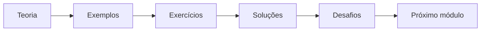

# 📘 Módulo 01 — Introdução ao SQL

> **Nível:** 🟢 Iniciante  
> **Tempo estimado:** 2 horas  
> **Ambiente principal:** Oracle Live SQL  
> **Pré-requisitos:** Nenhum

## Sobre este módulo

Bem-vindo ao **SQL Bootcamp**.

Este primeiro módulo apresenta os fundamentos necessários para acompanhar todo o curso. Você entenderá o que é um banco de dados relacional, para que serve a linguagem SQL, quais categorias de comandos existem e como executar seus primeiros scripts no Oracle Live SQL.

O objetivo não é decorar comandos, mas construir uma base sólida para compreender o que acontece quando uma aplicação grava, consulta, altera ou remove dados.

## Objetivos de aprendizagem

Ao concluir este módulo, você será capaz de:

- explicar o que é um banco de dados;
- diferenciar dado, informação, tabela, coluna e registro;
- compreender o modelo relacional;
- identificar a finalidade de um SGBD;
- explicar o que significa SQL;
- diferenciar SQL de PL/SQL;
- reconhecer comandos DQL, DML, DDL, TCL e DCL;
- executar comandos simples no Oracle Live SQL;
- interpretar mensagens básicas de sucesso e erro;
- seguir boas práticas iniciais de escrita de SQL.

## Conteúdo do módulo

| Arquivo | Descrição |
|---|---|
| [`teoria.md`](teoria.md) | Fundamentos de banco de dados, modelo relacional, SQL, Oracle e categorias de comandos |
| [`exemplos.sql`](exemplos.sql) | Exemplos introdutórios para executar no Oracle Live SQL |
| [`exercicios.md`](exercicios.md) | Exercícios conceituais e práticos por nível |
| [`desafios.md`](desafios.md) | Desafios de fixação baseados em cenários reais |
| [`solucoes.sql`](solucoes.sql) | Respostas comentadas dos exercícios práticos |
| [`boas-praticas.md`](boas-praticas.md) | Recomendações de organização, legibilidade e segurança |
| [`erros-comuns.md`](erros-comuns.md) | Erros frequentes de iniciantes e como corrigi-los |

## Como estudar

1. Leia [`teoria.md`](teoria.md).
2. Abra o Oracle Live SQL.
3. Execute [`exemplos.sql`](exemplos.sql) em pequenos blocos.
4. Resolva [`exercicios.md`](exercicios.md) sem consultar as respostas.
5. Compare suas consultas com [`solucoes.sql`](solucoes.sql).
6. Finalize com [`desafios.md`](desafios.md).

> [!TIP]
> Digite os comandos manualmente. A repetição ajuda a memorizar palavras-chave, pontuação e estrutura das consultas.

## Primeiro teste no Oracle

Execute o comando abaixo:

```sql
SELECT 'Olá, SQL Bootcamp!' AS mensagem
FROM dual;
```

Resultado esperado:

| MENSAGEM |
|---|
| Olá, SQL Bootcamp! |

No Oracle, `DUAL` é uma tabela especial utilizada quando queremos avaliar expressões sem consultar uma tabela de negócio.

## Fluxo de aprendizagem



## Checklist

Antes de avançar, confirme que você consegue responder:

- [ ] O que é um banco de dados?
- [ ] O que é um SGBD?
- [ ] O que é uma tabela?
- [ ] Qual é a diferença entre coluna e registro?
- [ ] O que significa SQL?
- [ ] Qual é a diferença entre SQL e PL/SQL?
- [ ] Para que servem DQL, DML, DDL, TCL e DCL?
- [ ] O que é o Oracle Live SQL?
- [ ] Para que serve a tabela `DUAL`?
- [ ] Como executar um comando SQL no navegador?

## Próximo módulo

➡️ [Módulo 02 — SELECT](../02-select)
