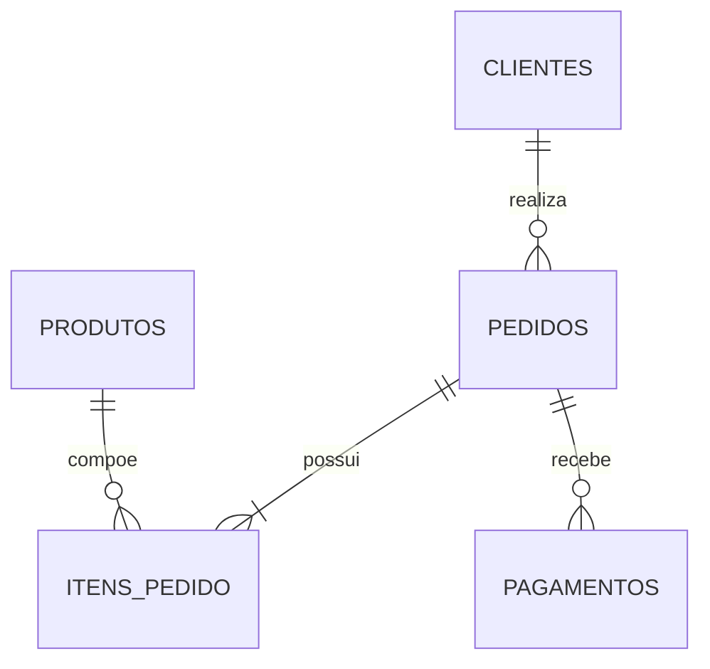
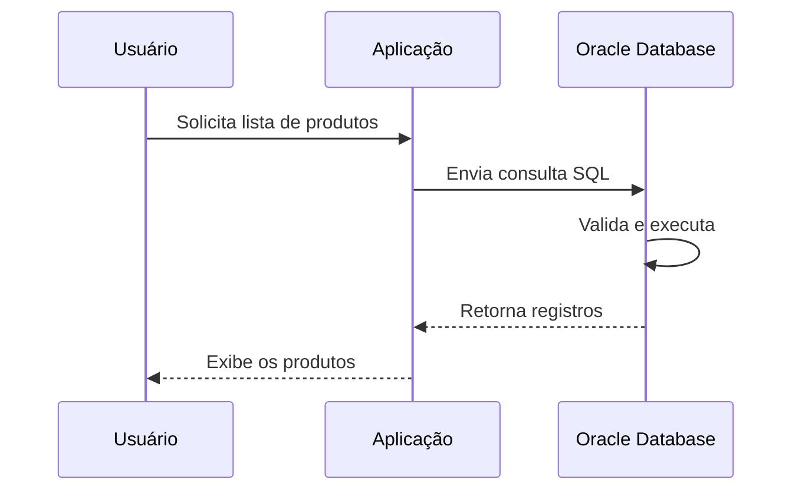

# Teoria — Introdução ao SQL

## 1. Dado e informação

Um **dado** é um valor isolado, ainda sem contexto completo. Exemplos:

- `1520`;
- `2026-07-24`;
- `Aprovado`;
- `R$ 249,90`.

Quando esses valores são organizados e associados a um contexto, tornam-se **informação**.

Exemplo:

> O pedido 1520 foi aprovado em 24/07/2026 no valor de R$ 249,90.

Sistemas corporativos trabalham com grandes volumes de dados. Um banco de dados existe para armazená-los de forma organizada, confiável, pesquisável e segura.

## 2. O que é um banco de dados

Um banco de dados é uma coleção estruturada de dados relacionados.

Em uma loja virtual, o banco pode armazenar:

- clientes;
- produtos;
- categorias;
- pedidos;
- itens de pedido;
- pagamentos;
- estoque;
- funcionários;
- transportadoras.

Esses dados não ficam isolados. Um pedido pertence a um cliente, possui itens e pode ter um ou mais pagamentos.



## 3. O que é um SGBD

SGBD significa **Sistema Gerenciador de Banco de Dados**.

Ele é o software responsável por permitir que aplicações e usuários criem, armazenem, consultem, alterem, protejam e recuperem dados.

Exemplos de SGBDs relacionais:

- Oracle Database;
- PostgreSQL;
- Microsoft SQL Server;
- MySQL;
- MariaDB;
- IBM Db2.

Entre as responsabilidades de um SGBD estão:

- controle de acesso;
- validação de regras;
- integridade dos dados;
- execução de consultas;
- controle de transações;
- concorrência entre usuários;
- backup e recuperação;
- auditoria;
- otimização de consultas.

## 4. Modelo relacional

No modelo relacional, os dados são representados principalmente por tabelas.

Uma tabela contém:

- **colunas**, que definem os atributos;
- **linhas**, que representam registros;
- **restrições**, que protegem a qualidade dos dados;
- **relacionamentos**, que conectam uma tabela a outra.

Exemplo simplificado da tabela `CLIENTES`:

| ID_CLIENTE | NOME | EMAIL | ATIVO |
|---:|---|---|:---:|
| 1 | Ana Lima | ana@email.com | S |
| 2 | Bruno Souza | bruno@email.com | S |
| 3 | Carla Mendes | carla@email.com | N |

### 4.1 Coluna

Uma coluna representa uma característica do registro.

Exemplos:

- `ID_CLIENTE`;
- `NOME`;
- `EMAIL`;
- `DATA_CADASTRO`;
- `ATIVO`.

Cada coluna possui um tipo de dado, como texto, número ou data.

### 4.2 Linha ou registro

Uma linha representa uma ocorrência completa.

Na tabela `CLIENTES`, cada linha representa um cliente.

### 4.3 Chave primária

A chave primária identifica cada registro de maneira única.

Exemplo:

```sql
ID_CLIENTE NUMBER PRIMARY KEY
```

Dois clientes não podem possuir o mesmo `ID_CLIENTE`.

### 4.4 Chave estrangeira

A chave estrangeira conecta tabelas.

Exemplo: `PEDIDOS.ID_CLIENTE` referencia `CLIENTES.ID_CLIENTE`.

```sql
CONSTRAINT FK_PEDIDOS_CLIENTES
    FOREIGN KEY (ID_CLIENTE)
    REFERENCES CLIENTES (ID_CLIENTE)
```

## 5. O que é SQL

SQL significa **Structured Query Language**, ou Linguagem de Consulta Estruturada.

Ela é utilizada para interagir com bancos de dados relacionais.

Com SQL podemos:

- consultar dados;
- inserir registros;
- alterar registros;
- excluir registros;
- criar tabelas;
- criar views e índices;
- controlar transações;
- conceder permissões.

Exemplo de consulta:

```sql
SELECT nome, email
FROM clientes;
```

Exemplo de inserção:

```sql
INSERT INTO clientes (id_cliente, nome, email, ativo)
VALUES (100, 'João Martins', 'joao@email.com', 'S');
```

## 6. SQL declarativo

SQL é uma linguagem predominantemente declarativa.

Isso significa que normalmente informamos **o que** desejamos obter, e o SGBD decide **como** executar.

```sql
SELECT nome
FROM clientes
WHERE ativo = 'S';
```

A consulta declara que queremos nomes de clientes ativos. O Oracle escolhe o plano de execução mais adequado com base nas tabelas, índices, estatísticas e condições envolvidas.

## 7. Padrão SQL e dialetos

Existe um padrão internacional para SQL, mantido por organizações de padronização. Entretanto, cada SGBD implementa recursos próprios.

Essas variações são chamadas informalmente de **dialetos SQL**.

Exemplo de limitar linhas:

### Oracle 12c ou superior

```sql
SELECT *
FROM produtos
FETCH FIRST 5 ROWS ONLY;
```

### PostgreSQL e MySQL

```sql
SELECT *
FROM produtos
LIMIT 5;
```

### SQL Server

```sql
SELECT TOP 5 *
FROM produtos;
```

O SQL Bootcamp utiliza Oracle como referência principal e apresenta diferenças importantes quando necessário.

## 8. Oracle Database

Oracle Database é um SGBD relacional amplamente utilizado em ambientes corporativos.

O Oracle oferece recursos como:

- SQL;
- PL/SQL;
- views;
- sequences;
- triggers;
- procedures;
- functions;
- packages;
- materialized views;
- controle avançado de transações;
- recursos de segurança e auditoria;
- ferramentas de análise e otimização.

## 9. Oracle Live SQL

Oracle Live SQL é um ambiente web para estudar e executar SQL e PL/SQL sem instalar o banco localmente.

Fluxo básico:

1. acesse o Oracle Live SQL;
2. faça login com uma conta Oracle;
3. abra a área SQL Worksheet;
4. cole ou digite um comando;
5. clique em Run;
6. analise o resultado ou a mensagem de erro.

> [!NOTE]
> Objetos criados no Oracle Live SQL pertencem ao seu ambiente de estudo. Eles podem ser recriados a qualquer momento executando os scripts da pasta `database/`.

## 10. SQL e PL/SQL

SQL e PL/SQL não são a mesma coisa.

### SQL

SQL é utilizada para trabalhar com dados e objetos do banco.

```sql
SELECT nome
FROM clientes;
```

### PL/SQL

PL/SQL é a linguagem procedural da Oracle. Ela adiciona variáveis, condições, loops, tratamento de exceções e blocos de código.

```sql
BEGIN
    DBMS_OUTPUT.PUT_LINE('Olá, PL/SQL!');
END;
/
```

| Característica | SQL | PL/SQL |
|---|---|---|
| Estilo | Declarativo | Procedural |
| Consultar dados | Sim | Pode executar SQL |
| Variáveis | Uso limitado conforme o ambiente | Sim |
| `IF`, loops e exceções | Não como linguagem principal | Sim |
| Procedures e packages | Não | Sim |

## 11. Categorias de comandos SQL

Os comandos são frequentemente agrupados por finalidade.

### 11.1 DQL — Data Query Language

Utilizada para consultar dados.

```sql
SELECT *
FROM clientes;
```

O principal comando é `SELECT`.

### 11.2 DML — Data Manipulation Language

Utilizada para manipular registros.

```sql
INSERT INTO clientes (...)
VALUES (...);

UPDATE clientes
SET ativo = 'N'
WHERE id_cliente = 10;

DELETE FROM clientes
WHERE id_cliente = 10;
```

Principais comandos:

- `INSERT`;
- `UPDATE`;
- `DELETE`;
- `MERGE`.

### 11.3 DDL — Data Definition Language

Utilizada para criar ou alterar estruturas.

```sql
CREATE TABLE categorias (
    id_categoria NUMBER PRIMARY KEY,
    nome         VARCHAR2(100) NOT NULL
);
```

Principais comandos:

- `CREATE`;
- `ALTER`;
- `DROP`;
- `TRUNCATE`;
- `RENAME`.

### 11.4 TCL — Transaction Control Language

Utilizada para controlar transações.

```sql
COMMIT;
ROLLBACK;
SAVEPOINT antes_da_alteracao;
```

Principais comandos:

- `COMMIT`;
- `ROLLBACK`;
- `SAVEPOINT`.

### 11.5 DCL — Data Control Language

Utilizada para controlar permissões.

```sql
GRANT SELECT ON clientes TO usuario_relatorio;
REVOKE SELECT ON clientes FROM usuario_relatorio;
```

Principais comandos:

- `GRANT`;
- `REVOKE`.

## 12. Objetos comuns do Oracle

### Tabela

Armazena registros.

### View

Representa uma consulta armazenada.

### Sequence

Gera valores numéricos sequenciais.

### Index

Pode acelerar o acesso a dados em determinados cenários.

### Synonym

Cria um nome alternativo para outro objeto.

### Procedure

Bloco PL/SQL executável que realiza uma tarefa.

### Function

Bloco PL/SQL que normalmente retorna um valor.

### Package

Agrupa procedures, functions, tipos e variáveis relacionadas.

### Trigger

Executa automaticamente em resposta a determinados eventos.

## 13. Estrutura básica de uma consulta

```sql
SELECT coluna1, coluna2
FROM nome_tabela
WHERE condicao
ORDER BY coluna1;
```

As cláusulas possuem finalidades diferentes:

- `SELECT`: define as colunas retornadas;
- `FROM`: informa a origem dos dados;
- `WHERE`: filtra registros;
- `ORDER BY`: ordena o resultado.

Embora a consulta seja escrita começando por `SELECT`, a ordem lógica de processamento não é exatamente a mesma ordem visual. Esse assunto será aprofundado nos próximos módulos.

## 14. A tabela DUAL

No Oracle, `DUAL` é uma tabela especial útil para avaliar expressões.

```sql
SELECT 2 + 2 AS resultado
FROM dual;
```

```sql
SELECT SYSDATE AS data_atual
FROM dual;
```

```sql
SELECT UPPER('sql bootcamp') AS texto
FROM dual;
```

## 15. Tipos de dados iniciais

Alguns tipos comuns no Oracle:

| Tipo | Finalidade | Exemplo |
|---|---|---|
| `NUMBER` | Números inteiros ou decimais | `150`, `249.90` |
| `VARCHAR2` | Texto de tamanho variável | `'Maria'` |
| `CHAR` | Texto de tamanho fixo | `'S'` |
| `DATE` | Data e hora até segundos | `SYSDATE` |
| `TIMESTAMP` | Data e hora com maior precisão | `SYSTIMESTAMP` |
| `CLOB` | Textos extensos | descrição longa |

## 16. Valores nulos

`NULL` representa ausência de valor.

Não é igual a:

- zero;
- texto vazio em todos os SGBDs;
- espaço;
- palavra `'NULL'`.

Para verificar ausência de valor, utilizamos:

```sql
WHERE email IS NULL
```

E não:

```sql
WHERE email = NULL
```

O tema será aprofundado no Módulo 09.

## 17. Sensibilidade a maiúsculas e minúsculas

Palavras-chave SQL não diferenciam maiúsculas de minúsculas na forma usual de uso:

```sql
select * from clientes;
```

é equivalente a:

```sql
SELECT *
FROM clientes;
```

Por convenção, o curso utiliza:

- palavras-chave em maiúsculas;
- objetos em minúsculas nos exemplos Markdown;
- indentação consistente;
- uma cláusula principal por linha.

Valores de texto podem diferenciar maiúsculas de minúsculas:

```sql
WHERE nome = 'Ana'
```

pode não encontrar um registro armazenado como `'ANA'`.

## 18. Comentários em SQL

Comentário de uma linha:

```sql
-- Consulta clientes ativos
SELECT *
FROM clientes;
```

Comentário em bloco:

```sql
/*
    Consulta utilizada no relatório mensal.
    Revisada em julho de 2026.
*/
SELECT *
FROM pedidos;
```

## 19. Ponto e vírgula

O ponto e vírgula indica o final de uma instrução em muitos clientes SQL.

```sql
SELECT SYSDATE
FROM dual;
```

Em scripts com vários comandos, ele é especialmente importante.

## 20. Como interpretar erros

Erros fazem parte do aprendizado.

Quando o Oracle apresenta uma mensagem, observe:

1. o código, como `ORA-00942`;
2. a descrição;
3. a linha e a coluna indicadas;
4. nomes de tabelas e colunas;
5. vírgulas, aspas e parênteses;
6. se o objeto foi criado anteriormente.

Exemplo:

```text
ORA-00942: table or view does not exist
```

Pode indicar:

- nome digitado incorretamente;
- tabela ainda não criada;
- objeto em outro schema;
- falta de permissão.

## 21. Fluxo entre aplicação e banco



Aplicações em C#, Java, Python, JavaScript e outras linguagens enviam comandos SQL ao banco. Por isso, compreender SQL é importante mesmo para quem não deseja atuar como DBA.

## 22. Resumo

Neste módulo, você aprendeu que:

- bancos de dados organizam dados relacionados;
- um SGBD gerencia armazenamento, segurança, integridade e acesso;
- o modelo relacional utiliza tabelas, colunas, linhas e relacionamentos;
- SQL permite consultar, manipular e definir dados;
- Oracle possui seu próprio dialeto e recursos adicionais;
- PL/SQL complementa SQL com programação procedural;
- comandos podem ser classificados como DQL, DML, DDL, TCL e DCL;
- Oracle Live SQL permite estudar diretamente pelo navegador;
- `DUAL` pode ser utilizada para avaliar expressões no Oracle.
